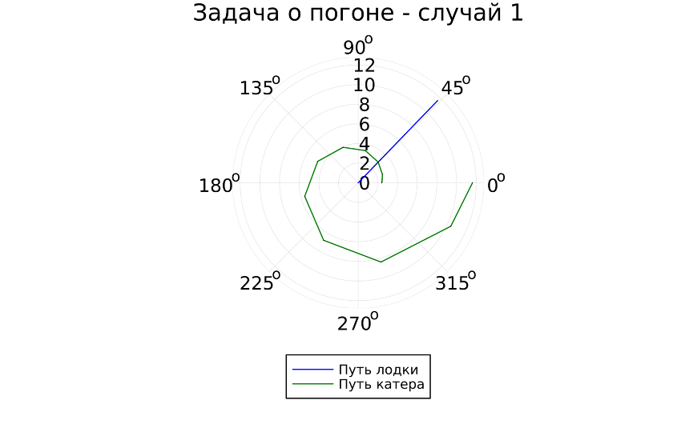

---
## Front matter
lang: ru-RU
title: Лабораторная работа №2
subtitle: Математическое моделирование
author:
  - Петрова Мария Евгеньевна
institute:
  - Российский университет дружбы народов, Москва, Россия
date: 2024

## i18n babel
babel-lang: russian
babel-otherlangs: english

## Formatting pdf
toc: false
toc-title: Содержание
slide_level: 2
aspectratio: 169
section-titles: true
theme: metropolis
header-includes:
 - \metroset{progressbar=frametitle,sectionpage=progressbar,numbering=fraction}
 - '\makeatletter'
 - '\beamer@ignorenonframefalse'
 - '\makeatother'
---

## Докладчик

:::::::::::::: {.columns align=center}
::: {.column width="70%"}

  * Петрова Мария Евгеньевна
  * Студентка группы НФИбд-02-21
  * Студ. билет 1032216450
  * Российский университет дружбы народов

:::
::: {.column width="30%"}

:::
::::::::::::::

## Цель лабораторной работы

- Изучить основы языков программирования Julia и OpenModelica. Освоить библиотеки этих языков, которые используются для построения графиков и решения дифференциальных уравнений. Решить задачу о погоне. 

## Задание лабораторной работы

Задания лабораторной работы разделены по вариантам. Мой вариант 21

(исходя из формулы $N_{student} mod K_{of variants} + 1$).

Этот же вариант будет использоваться для всех последующих лабораторных работ.

{#fig:001}

## Задание лабораторной работы

### Задача о погоне. Вариант 30:

На море в тумане катер береговой охраны преследует лодку браконьеров.
Через определенный промежуток времени туман рассеивается, и лодка
обнаруживается на расстоянии 9,4 км от катера. Затем лодка снова скрывается в
тумане и уходит прямолинейно в неизвестном направлении. Известно, что скорость
катера в 3,7  раза больше скорости браконьерской лодки.

## Задачи:

1. Записать уравнение, описывающее движение катера, с начальными условиями для двух случаев (в зависимости от расположения катера относительно лодки в начальный момент времени).
2. Построить траекторию движения катера и лодки для двух случаев.
3. Найти точку пересечения траектории катера и лодки

## Теоретическая справка (1)

### Справка о языках программирования

- Julia — высокоуровневый высокопроизводительный свободный язык программирования с динамической типизацией, созданный для математических вычислений. Эффективен также и для написания программ общего назначения. Синтаксис языка схож с синтаксисом других математических языков (например, MATLAB и Octave), однако имеет некоторые существенные отличия. Julia написан на Си, C++ и Scheme. Имеет встроенную поддержку многопоточности и распределённых вычислений, реализованные в том числе в стандартных конструкциях.

## Теоретическая справка (1)

### Справка о языках программирования

- OpenModelica — свободное открытое программное обеспечение для моделирования, симуляции, оптимизации и анализа сложных динамических систем. Основано на языке Modelica. Активно развивается Open Source Modelica Consortium, некоммерческой неправительственной организацией. Open Source Modelica Consortium является совместным проектом RISE SICS East AB и Линчёпингского университета. По своим возможностям приближается к таким вычислительным средам как Matlab Simulink, Scilab xCos, имея при этом значительно более удобное представление системы уравнений исследуемого блока.

## Теоретическая справка (2)

### Математическая справка

- Дифференциальное уравнение — уравнение, которое помимо функции содержит её производные. Порядок входящих в уравнение производных может быть различен (формально он ничем не ограничен). Производные, функции, независимые переменные и параметры могут входить в уравнение в различных комбинациях или отсутствовать вовсе, кроме хотя бы одной производной. Не любое уравнение, содержащее производные неизвестной функции, является дифференциальным. 

## Теоретическая справка (3)

### Физические термины

- Тангенциальная скорость - составляющая вектора скорости, перпендикулярная линии, соединяющей источник и наблюдателя. Измеряется собственному движению - угловому перемещению источника.
- Радиальная скорость — проекция скорости точки на прямую, соединяющую её с выбранным началом координат.
- Полярная система координат — двумерная система координат, в которой каждая точка на плоскости определяется двумя числами — полярным углом и полярным радиусом.

# Ход выполнения лабораторной работы

## Построение математической модели (1)

1. Примем за момент отсчета времени момент первого рассеивания тумана. Введем полярные координаты с центром в точке нахождения браконьеров
и осью, проходящей через катер береговой охраны. Тогда начальные координаты катера (12,2; 0). Обозначим скорость лодки $v$.
2. Траектория катера должна быть такой, чтобы и катер, и лодка все время были на одном расстоянии от полюса. Только в этом случае траектория катера пересечется с траекторией лодки. Поэтому для начала катер береговой охраны должен двигаться некоторое время прямолинейно, пока не окажется на том же расстоянии от полюса, что и лодка браконьеров. После этого катер береговой охраны должен двигаться вокруг полюса удаляясь от него с той же скоростью, что и лодка браконьеров.

## Построение математической модели (2)

3. Чтобы найти расстояние x (расстояние после которого катер начнет двигаться вокруг полюса), необходимо составить следующие уравнение. Пусть через время t катер и лодка окажутся на одном расстоянии x от полюса. За это время лодка пройдет $x$, а катер $12,2 + x$ (или $12,2 - x$, в зависимости от начального положения катера относительно полюса). Время, за которое они пройдут это расстояние, вычисляется как $x\over v$ или ${12,2 - x}\over{4,1v}$ (${12,2 + x}\over{4,1v}$). Так как время должно быть одинаковым, эти величины тоже будут друг другу равны. Из этого получаем объединение из двух уравнений (двух из-за двух разных изначальных позиций катера относительно полюса):

$$ \left[ \begin{array}{cl}
{{x}\over{v}} = {{12,2 - x}\over{4,1v}}\\
{{x}\over{v}} = {{12,2 + x}\over{4,1v}}
\end{array} \right. $$

## Построение математической модели (3)

Из данных уравнений можно найти расстояние, после которого катер начнёт раскручиваться по спирали. Для данных уравнений решения будут следующими: $x_1 = {{122}\over{51}}$, $x_2 = {{122}\over{31}}$. Задачу будем решать для двух случаев. После того, как катер береговой охраны окажется на одном расстоянии от полюса, что и лодка, он должен сменить прямолинейную траекторию и начать двигаться вокруг полюса удаляясь от него со скоростью лодки v. Для этого скорость катера раскладываем на две составляющие: $v_r = {dr\over dt} = v$ - радиальная скорость и $v_\tau = r{d\theta\over dt}$ - тангенциальная скорость.

$$ v_\tau = {{\sqrt{1581}v}\over{10}} $$

## Построение математической модели (4)

4. Решение исходной задачи сводится к решению системы из двух дифференциальных уравнений:

$$ \left\{ \begin{array}{cl}
{dr\over dt} = v \\
r{d\theta\over dt} = {{\sqrt{1581}v}\over{10}}
\end{array} \right. $$

## Построение математической модели (5)

C начальными условиями: 

$$ \left\{ \begin{array}{cl}
\theta_0 = 0 \\
r_0 = x_1 = {{122}\over{51}}
\end{array} \right. $$

или

$$ \left\{ \begin{array}{cl}
\theta_0 = -\pi \\
r_0 = x_2 = {{122}\over{31}}
\end{array} \right. $$

## Построение математической модели (5)

Исключая из полученной системы производную по t, можно перейти к следующему уравнению (с неизменными начальными условиями):

$$ {dr\over d\theta} = {10r\over\sqrt{1581}} $$

Решением этого уравнения с заданными начальными условиями и будет являться траектория движения катера в полярных координатах. 

# Решение с помощью программ

## OpenModelica

К сожалению, OpenModelica не адаптирована к использованию полярных координат, поэтому адекватное отображение результатов данный задачи там невозможно.

## Julia

Решить дифференциальное уравнение, расписанное в постановке задачи лабораторной работы, поможет библиотека DifferentialEquations. Итоговые изображения в полярных координатах будут строиться через библиотеку Plots. [1]

- Установим Julia
- Установим нужные библиотеки, проверим их установку

## Julia

{#fig:003}

## Результаты работы кода на Julia (1)

На рис. @fig:004 и @fig:005 изображены итоговые графики траектории движения катера и лодки для случая обоих случаев.

{#fig:004}

## Результаты работы кода на Julia (1)

На рис. @fig:004 и @fig:005 изображены итоговые графики траектории движения катера и лодки для случая обоих случаев.

{#fig:005}

## Анализ полученных результатов

Мною были построены графики для обоих случаев. На них получилось отрисовать трактерию катера, траекторию лодки и получилось наглядно найти их точки пересечения. Мы успешно решили задачу о погоне.

# Вывод

## Вывод

Были изучены основы языков программирования Julia и OpenModelica. Освоены библиотеки этих языков, которые используются для построения графиков и решения дифференциальных уравнений. Поскольку OpenModelica не работает с полярными координатами, она пока что не была использована в данной лабораторной работе. 

## Список литературы. Библиография

[1] Документация по Julia: https://docs.julialang.org/en/v1/

[2] Документация по OpenModelica: https://openmodelica.org/

[3] Решение дифференциальных уравнений: https://www.wolframalpha.com/